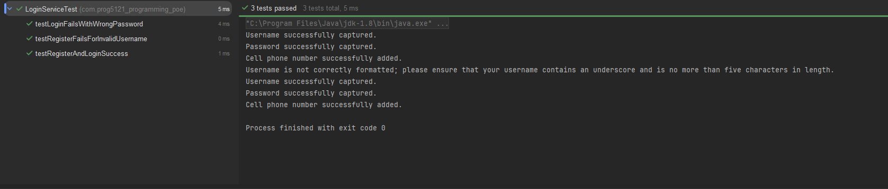

# PROG5121 Programming POE

A Java console application for user registration and login with input validation and unit testing.

## Project Overview

This project demonstrates:
- User registration with validation for username, password, and South African cell number.
- User authentication using stored registration credentials.
- Clear confirmation and error messages during registration and login.
- Unit tests for validation logic and login flow.

## Implemented Features

### Registration Feature
- Captures first name and last name.
- Validates username (`_` required, max length 5).
- Validates password complexity (minimum 8 chars, uppercase, number, special character).
- Validates phone number in SA international format (`+27` followed by 9 digits).
- Uses retry/exit branching when invalid data is entered.

### Login Feature
- Allows login with registered username and password.
- Uses appropriate decision structures (`if`, `while`, boolean checks) to verify user authentication.
- Limits login attempts to 3.
- Displays correct confirmation and error messages.

## Decision Structure Used for Authentication

Authentication is handled by boolean decision logic:
- `loginUser(username, password)` returns `true` only when:
  - a user has been registered,
  - username matches the stored username,
  - password matches the stored password.
- `returnLoginStatus(isLoggedIn)` returns:
  - Welcome message when `isLoggedIn == true`.
  - Error message when `isLoggedIn == false`.

## Confirmation and Error Messages

Implemented examples include:
- `Username successfully captured.`
- `Password successfully captured.`
- `Cell phone number successfully added.`
- `Username is not correctly formatted; please ensure that your username contains an underscore and is no more than five characters in length.`
- `Password is not correctly formatted; please ensure that the password contains at least eight characters, a capital letter, a number, and a special character.`
- `Cell phone number incorrectly formatted or does not contain international code.`
- `Username or password incorrect, please try again.`

## Unit Tests

### Validation Tests
File: `src/test/java/com/prog5121_programming_poe/ValidationServiceTest.java`

Covers:
- Valid and invalid username checks.
- Valid and invalid password complexity checks.
- Valid and invalid phone number checks.

### Login Tests
File: `src/test/java/com/prog5121_programming_poe/LoginServiceTest.java`



Covers:
- Successful registration and successful login.
- Failed login due to incorrect password.
- Failed registration due to invalid username.
- Correct login status messaging.


## How to Run

```bash
cd "/c/Users/itume/IdeaProjects/PROG5121_Programming_POE"
```

Run from IntelliJ by executing `Main` in `src/main/java/org/example/Main.java`.

## How to Run Tests

Run tests from IntelliJ test runner for:
- `ValidationServiceTest`
- `LoginServiceTest`

If Maven is available in your terminal:

```bash
cd "/c/Users/itume/IdeaProjects/PROG5121_Programming_POE"
mvn test
```

## Project Structure

- `src/main/java/model/User.java`
- `src/main/java/service/ValidationService.java`
- `src/main/java/service/LoginService.java`
- `src/main/java/org/example/Main.java`
- `src/test/java/com/prog5121_programming_poe/ValidationServiceTest.java`
- `src/test/java/com/prog5121_programming_poe/LoginServiceTest.java`

